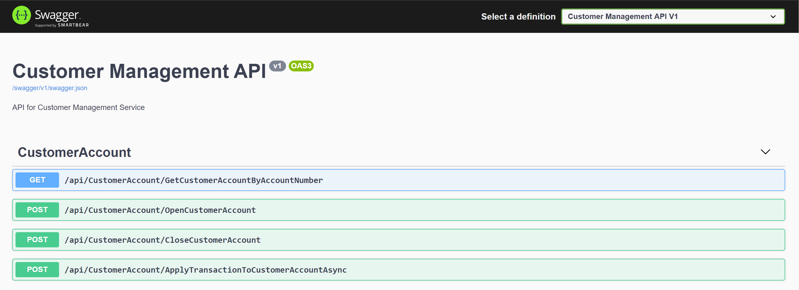
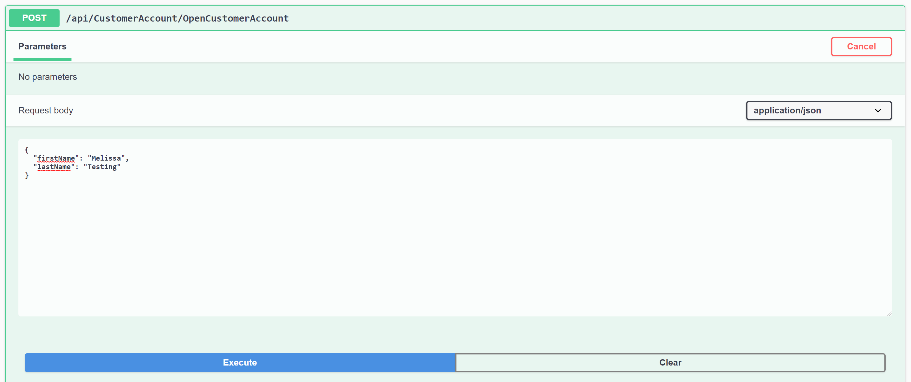
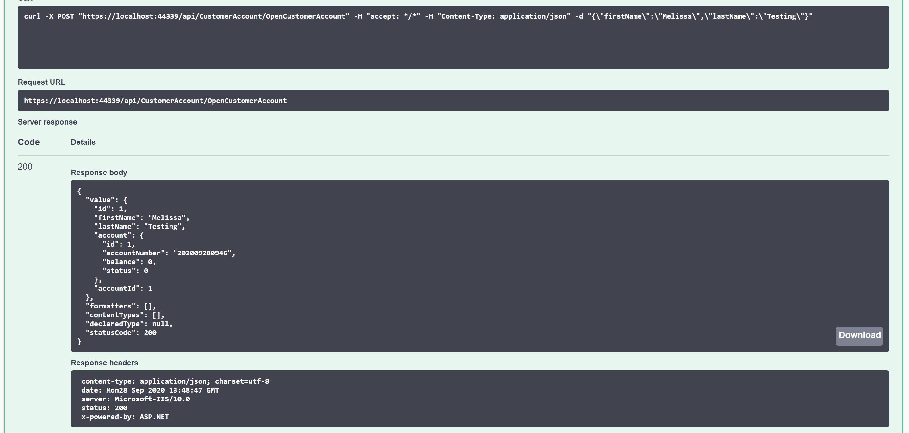
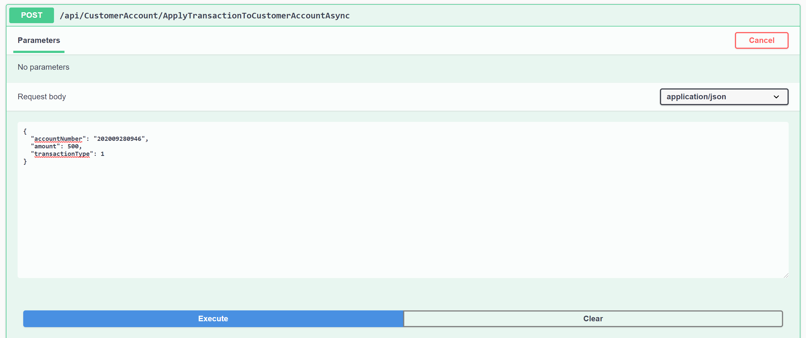
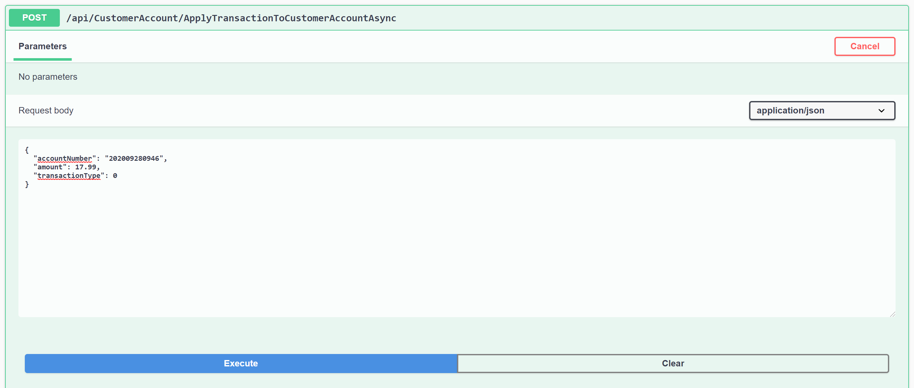
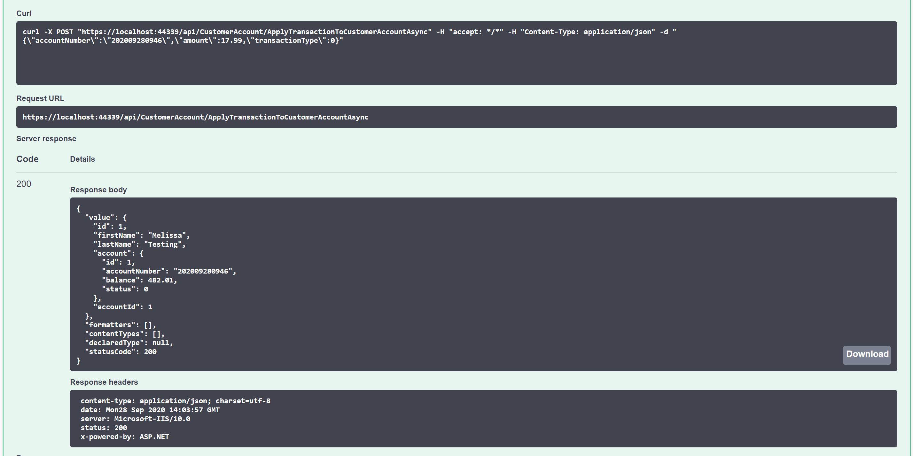
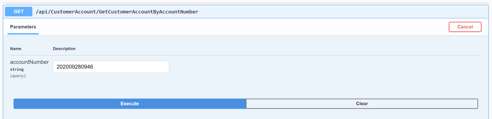
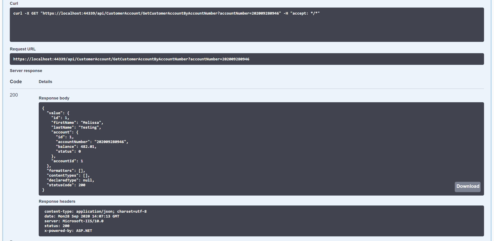
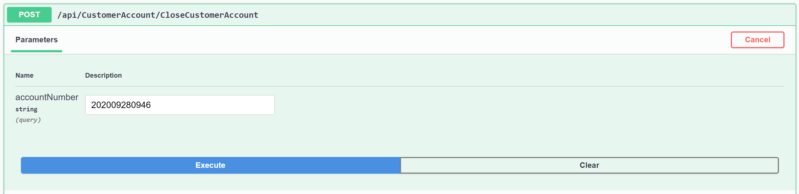
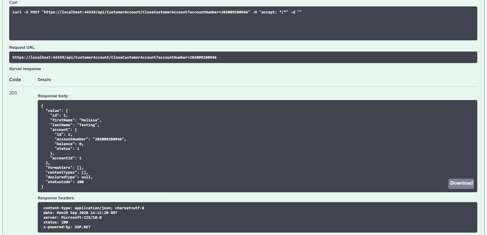

# Customer Management Service - High-Level Requirements

Your team's goal is to build an API for the customer, account and transaction operations outlined below. This API will be a microservice that can be:
1) Developed in the technology of your team's choosing
2) Independently-deployed
3) Independently-scaled

By building this API/microservice, we are helping to position this client for beginning their journey to the Cloud. Using a Hybrid Cloud approach, the client will be able to move this critical service into the Cloud and integrate their on-prem interfaces and services with the new service.

Ultimately, this API/microservice will have its own data source. However, if you are unable to fully implement in the time allotted to the borathon, you can use in-memory data structures as an alternative.

Finally, once you complete development of the API, feel free to explore, as a team, options for deploying to either AWS or Azure. Some alternatives to consider:
1) IaaS - VM's with runtime environment to host the microservice
2) PaaS - e.g. Elastic Beanstalk in AWS or App Services in Azure
3) Containers - Either locally or Cloud-deployed runtime (e.g. ECS in AWS or AKS in Azure)

Below, you will find definitions for the data structures and a brief description of each operation targeted for inclusion in your API:

Account
- ID (internal ID - integer) - record ID
- Account Number (external ID - string) - use an algorithm of your choosing to generate or assign a new account number on account opening
- Balance (decimal value)
- Account Status (can be either Open or Closed)

Customer (**NOTE: For borathon purposes, you can assume each customer has only one account**)
- ID (internal ID - integer) - record ID
- First Name (string)
- Last Name (string)
- Associated Account - e.g. foreign key relationship

Transaction
- ID (internal ID - integer) - record ID
- Amount (decimal value - always positive)
- Transaction Type (can be either Debit or Credit)
- Associated Account - e.g. foreign key relationship

Supported Operations
- Retrieve customer/account details by account number - on supply of the account number, retrieve customer/account details, including current account balance
- Open customer account - on supply of the first name and last name for the customer, create a new customer record, create a new account record (with an initial $0.00 balance) and return customer/account details for the new account
- Close customer account - on supply of the account number, update the account to a "Closed" status
- Apply a transaction to the customer account - on supply of the account number, transaction amount and type of transaction ("Debit" or "Credit"), create a new transaction record and update the account balance accordingly

Below are Swagger screenshots to provide some additional info/guidance. You do not have to use Swagger for testing - you can use POSTMan (or similar). Also, the launch-demo-api has been included in the GitHub repo as an example API (C#).

## Overview

## Open Account

## Apply Credit Transaction

## Apply Debit Transaction

## Retrieve Account Details

## Close Account

